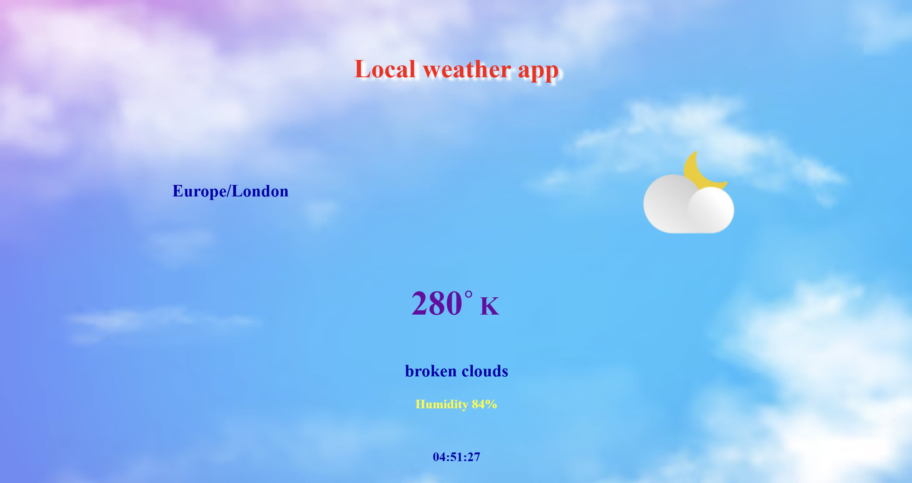

# 📚 Book List App (SQL Server + Node.js)

A full-stack web application to manage a **book list** using **SQL Server** as the database and a **Node.js + Express** backend.
Users can **add, edit, delete, search, and hide books** with a clean and responsive interface.

---

## 🚀 Features

*  CRUD operations (Create, Read, Update, Delete)
*  Inline editing of book names
*  Live search (real-time filtering)
*  Hide / Show book list
*  Prevent duplicate books
*  Smooth scroll to new items
*  Clean and responsive UI

---

## 🛠️ Technologies Used

* **Frontend:** HTML, CSS, Vanilla JavaScript
* **Backend:** Node.js, Express
* **Database:** SQL Server
* **Other:** Fetch API, CORS, dotenv

---

## 📂 Project Structure

```
Book-List-Sql/
│
├─ index.html
├─ style.css
├─ main.js
│
├─ modules/
├─ routes/
├─ data/
│
├─ server.js
├─ BookListScript.sql     # Database script (schema + data)
├─ .env.example           # Environment variables template
├─ .gitignore
└─ README.md
```

---

## 📦 Requirements

- Node.js (v16+ recommended)
- SQL Server
- SQL Server Management Studio (SSMS)

---

## ⚙️ Setup & Installation

### 1️⃣ Clone the repository

```bash
git clone https://github.com/yourusername/books-list-sql.git
cd Book-List-Sql
```

---

### 2️⃣ Install dependencies

```bash
npm install
```

---

### 3️⃣ Setup Environment Variables

Create a `.env` file in the root:

```env
DB_USER=your_username
DB_PASSWORD=your_password
DB_SERVER=localhost
DB_NAME=List
PORT=3000
```

**Tip**: Do not push your real `.env` file to GitHub. Use `.env.example` as a template.

---

### 4️⃣ Setup Database (IMPORTANT)

1. Open the script in SQL Server Management Studio (SSMS) and execute it.

2. Run the provided SQL script:

```
BookListScript.sql
```

3. This script will automatically:

* Create database
* Create table
* Insert sample data

**Note for beginners**:
If your SQL Server already has a database named `List`, the script will use it. The table `tblBookList` will be replaced. Make sure you don’t have important data in a table with the same name.

---

### 5️⃣ Start the server

```bash
node server.js
```

Server runs on:

```
http://localhost:3000
```

---

### 6️⃣ Open the frontend

* Open `index.html` using Live Server (recommended)

Make sure CORS matches your frontend URL (e.g. Live Server):

```js
origin: 'http://127.0.0.1:5500'
```

---

## 🎮 Usage

*  Add a book → Type name → Click **ADD**
*  Edit → Click **Edit**, modify text, press **Enter**
*  Delete → Click **Delete**
*  Search → Type in search box
*  Hide → Use checkbox

---

## 📝 License

This project is licensed under the **MIT License**.

---

## 🌐 Resources

* https://nodejs.org/
* https://www.microsoft.com/sql-server/

---

## 📸 Screenshot


;; =============================================


;; # 🌐 Local Weather App

;; ## 📌 About the Project

;; This Local Weather App is built using Vanilla JavaScript and displays real-time weather conditions based on the user’s location.

;; The application detects the user's location using IP geolocation and fetches weather data from the **OpenWeatherMap API**.

;; The app displays the current weather information including **temperature, weather description, humidity, timezone, and a dynamic weather icon**.

;; ---

;; ## 🌍 Live Demo

;; [Live Demo](https://yourusername.github.io/weather-app/)

;; --- 

;; ### 🚀 Features

;; The application provides:

;;  - 🌡️ Temperature in Celsius, Fahrenheit, and Kelvin
;;  - 📍 User location timezone
;;  - ☁️ Dynamic weather icons
;;  - 💧 Humidity level
;;  - 📝 Weather description
;;  - ⏰ Real-time local clock

;; --- 

;; ### 🛠️ Technologies Used

;;  - HTML5
;;  - CSS3
;;  - Vanilla JavaScript (ES6+)
;;  - OpenWeatherMap API
;;  - IP-API (Location detection)

;; External APIs used:

;; - https://openweathermap.org/api
;; - https://ip-api.com

;; --- 

;; ### ⚙️ Configuration

;; To run this project, you need an OpenWeatherMap API key.

;; Steps to get your API key:

;;  1. Go to https://openweathermap.org/
;;  2. Create a free account or log in.
;;  3. Navigate to **API Keys** in your profile.
;;  4. Generate a new API key.
;;  5. Open **app.js** and replace the API key:

;; ```javascript
;; const API_KEY = 'YOUR_API_KEY_HERE';
;; ```

;; ### 📂 Project Structure

;; ```text
;; weather-app
;; │
;; ├── index.html
;; ├── style.css
;; ├── app.js
;; ├── images/
;; ├── app-images/
;; ├── icon/
;; └── README.md
;; ```

;; ### ▶️ How to Run the Project
;; 1. Clone the repository

;; ```bash
;; git clone https://github.com/youruser-name/weather-app.git
;; ```

;; 2. Open the **project folder**.

;; 3. Open **index.html** in your browser.

;; ---

;; ### 👨‍💻 Author

;; Your Name  
;; GitHub: https://github.com/yourusername

;; ---

;; ### 📸 Screenshots

;; 
;; 


;; ==============================================================


;; # 📚 Book List Manager (React)

;; A simple React application that allows users to manage a list of books.
;; Users can add, view, and delete books while interacting with a local API.

;; The application demonstrates modern React practices, including component architecture, async data fetching, loading states, error handling, and cross-component communication.

;; --- 

;; ## 🚀 Features

;; - Fetch and display books from an API
;; - Add new books through a modal form
;; - Delete books from the list
;; - Toggle visibility of the book list (Show / Hide)
;; - Loading indicator while fetching data
;; - Error handling for API requests
;; - Dynamic success message when a book is added or deleted
;; - Responsive UI with CSS modules
;; - Automatic UI updates using React state


;; ## 🛠 Technologies Used

;; - React
;; - JavaScript (ES6+)
;; - CSS Modules
;; - Fetch API
;; - JSON Server (local API)


;; ## 📂 Project Structure

;; ```
;; src
;; ├── component
;; │   ├── Book-list-manager
;; │   ├── eventlist
;; │   ├── modalBox
;; │   ├── modal-details
;; │   ├── handle-show
;; │   └── title
;; │
;; ├── App.jsx
;; └── main.jsx
;; ```

;; ## ⚙️ Installation

;; Clone the repository:

;; ```bash
;; git clone https://github.com/Star1One/books-list-manager.git
;; cd books-list-manager
;; npm install
;; ```

;; ### Run the JSON Server (Local API):

;; ```bash
;; npx json-server --watch db.json --port 3000
;; ```

;; Start the React application:

;; ```bash
;; npm run start
;; ```

;; ### 🌐 API endpoint:

;; ```
;; http://localhost:3000/books
;; ```

;; ;; project URL (for example from Netlify, Vercel, or GitHub Pages):
;; ### 🔗 Live Demo:

;; [View the Live Application](https://your-project-demo-link.com)


;; ## 🧠 Key React Concepts Demonstrated

;; This project demonstrates several important React concepts:

;; - **State Management**

;; Using useState to manage UI state.

;; - **Side Effects**

;;   Using useEffect to fetch API data.

;; - **Async / Await**

;;   Handling asynchronous API requests cleanly.

;; - **Error Handling**

;;   Using try / catch for API operations.

;; - **Conditional Rendering**

;;   Displaying loading indicators, messages, and data conditionally.

;; - **Component Communication**

;;   Using:
;;   - `forwardRef`
;;   - `useImperativeHandle`

;; to trigger UI updates across components.

;; ### 🔄 Application Flow

;; Books are fetched from the API.

;; Loading spinner appears during the request.

;; Users can:

;; Add a book via modal form

;; Delete books from the list

;; After adding or deleting book:

;; A success message appears

;; The message resets automatically after a few seconds.

;; ### 🎨 UI Behavior

;; Loading spinner during API fetch

;; Empty list message when no books exist

;; Success notification after adding or deleting a book

;; Responsive layout for smaller screens

;; ### 🚧 Future Improvements

;; Possible improvements for the project:

;; Edit book functionality

;; Persistent notifications system

;; Form validation

;; Global state management using React Context API

;; ### Author

;; Developed as a React learning project to practice component architecture, asynchronous operations, and UI state management.

;; ### License

;; This project is open-source and available under the MIT License.

;; ...

;; ### 📸 Screenshots

;; 


;; =======================


;; git clone https://github.com/your-username/book-list-manager.git


;; =============================================
;; GitHub profile:

;; # Hi 👋 I'm Sam Anderson

;; Frontend Developer based in the UK 🇬🇧

;; I am a self-taught software developer with a Master's degree in Artificial Intelligence and Robotics.  
;; I enjoy building modern web applications using React, Next.js and TypeScript.

;; My focus is creating **clean, responsive and user-friendly interfaces**.

;; ---

;; ## 🚀 Tech Stack

;; ### Frontend
;; HTML • CSS • JavaScript • TypeScript  
;; React • Next.js • Tailwind CSS

;; ### Backend
;; Python • Node.js

;; ### Database
;; SQL Server

;; ### Machine Learning / AI
;; PyTorch • Scikit-learn

;; ### Tools
;; Git • GitHub

;; ---

;; ## 📌 Featured Projects

;; ### 📚 Online Book Store (React)
;; React • TypeScript • Tailwind CSS  
;; 🔗 Live Demo: LINK  
;; 🔗 Code: https://github.com/your-repo

;; ### 📚 Online Book Store (Next.js)
;; Next.js • TypeScript • Tailwind CSS  
;; 🔗 Live Demo: LINK  
;; 🔗 Code: https://github.com/your-repo

;; ### 🌦 Weather App
;; JavaScript • Weather API  
;; 🔗 Code: https://github.com/your-repo

;; ### Book List

;; ### 📖 Book Management System
;; JavaScript • SQL Server  
;; 🔗 Code: https://github.com/your-repo

;; ---

;; ## 🎯 Career Goal:

;; I am currently looking for a **Frontend Developer position** where I can contribute to building modern web applications and continue improving my development skills.

;; ---

;; ## 📫 Contact

;; 📧 Email: sam-a168@yahoo.com  
;; 💻 GitHub: https://github.com/sam-a168  
;; 🔗 LinkedIn: (LinkedIn address)

;; ---

;; # test
;; evaluate

